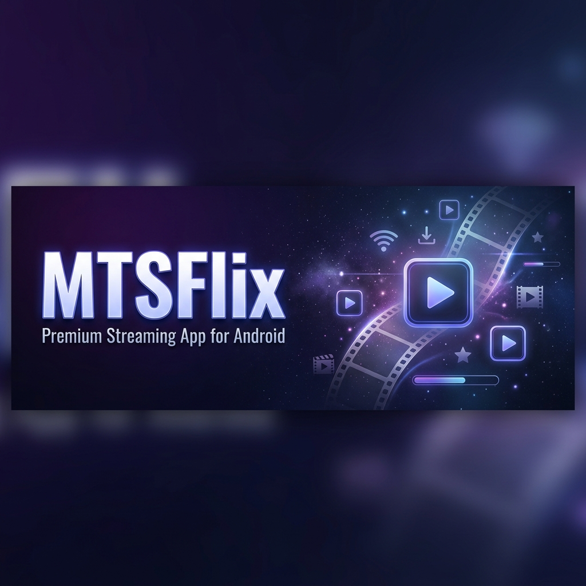
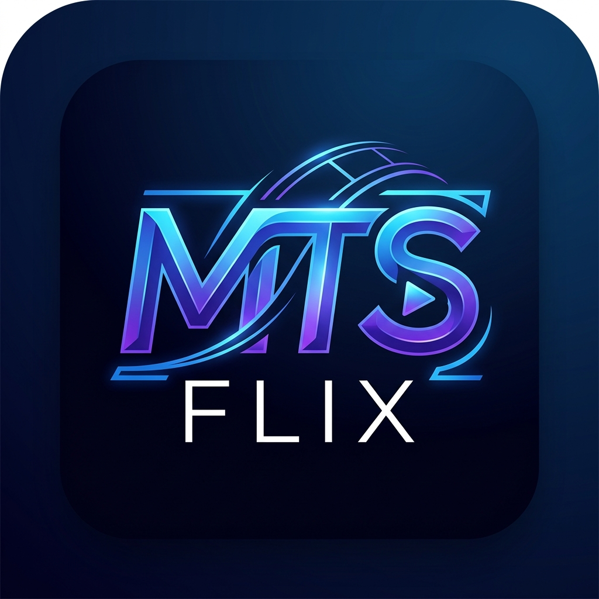

<p align="center">
  
</p>

<p align="center">
  
</p>

<h1 align="center">MTSFlix</h1>

<p align="center">
  <strong>Aplikasi Penstriman Video Premium untuk Android</strong><br/>
  Dibina di atas <a href="https://github.com/recloudstream/cloudstream">CloudStream 3</a> dengan ciri eksklusif MTS
</p>

<p align="center">
  <a href="https://github.com/muhamadakmal854-svg/MTSFlix/releases/latest">
    
  </a>
  <a href="https://github.com/muhamadakmal854-svg/MTSFlix/releases/latest">
    
  </a>
  <a href="https://github.com/muhamadakmal854-svg/MTSFlix/actions">
    
  </a>
  
</p>

---

## 📥 Download APK

> **Download terkini:** [MTSFlix Latest Release](https://github.com/muhamadakmal854-svg/MTSFlix/releases/latest)

| Versi | Saiz | Platform |
|-------|------|----------|
| v1.0.0 | ~70 MB | Android 5.0+ (API 21+) |

---

## ✨ Ciri-Ciri Utama

| Ciri | Keterangan |
|------|-----------|
| 🔐 **Pengesahan Peranti** | Kod unik untuk setiap peranti — kawalan akses selamat |
| 🔑 **Login Google** | Daftar masuk dengan akaun Google via Firebase |
| 🔔 **Notifikasi Episod** | Pemberitahuan automatik bila episod baru keluar |
| 🔌 **Provider Auto-Sync** | Extension provider dikemas kini tanpa perlu reinstall |
| 📥 **Auto-Update APK** | Kemaskini APK terus dalam aplikasi |
| 🚫 **Tiada Iklan** | Pengalaman menonton tanpa gangguan iklan |
| 🌐 **Multi-Bahasa** | Kandungan dengan subtitle pelbagai bahasa |
| 📺 **Multi-Server** | Putar dari pelbagai pelayan video |

---

## 🔌 Provider MTS (Extension)

MTSFlix menggunakan sistem extension untuk mengakses sumber video. Provider MTS dikonfigurasikan secara automatik semasa pemasangan.

**Repo Provider:**
```
https://cdn.jsdelivr.net/gh/muhamadakmal854-svg/Provider@builds/repo.json
```

| Provider | Domain | Kandungan |
|----------|--------|-----------|
| 🎬 Anichin | anichin.moe | Anime Sub Indonesia |
| 🎭 Animexin | animexin.dev | Anime Multi-Bahasa |
| 🎥 KlikXXI | flagsio.com | Filem & TV Melayu |
| *(lebih akan ditambah)* | | |

---

## 🚀 Cara Pasang

### Pasang Baru
1. **Download APK** dari [Releases](https://github.com/muhamadakmal854-svg/MTSFlix/releases/latest)
2. Pergi ke **Tetapan → Keselamatan → Allow Unknown Sources**
3. Pasang fail APK
4. Buka MTSFlix → Login dengan Google
5. Provider akan dimuat turun secara automatik ✅

### Kemaskini (Update)
App MTSFlix akan **memaparkan notifikasi update** secara automatik bila versi baru tersedia.

Klik **"Kemaskini Sekarang"** dalam app → APK baru akan dimuat turun dan dipasang automatik.

> ⚠️ Data & tetapan anda **tidak akan hilang** semasa update (gunakan signing key yang sama)

---

## 🔄 Auto-Update

MTSFlix mempunyai sistem auto-update yang menyemak `version.json` di repo ini:

```
https://raw.githubusercontent.com/muhamadakmal854-svg/MTSFlix/main/version.json
```

Setiap kali versi baru dibina, `version.json` dikemas kini secara automatik oleh GitHub Actions.

---

## 🏗️ Cara Build (Untuk Pembangun)

Repository ini menggunakan **GitHub Actions** untuk membina APK secara automatik.

### Prasyarat (GitHub Secrets)

| Secret | Keterangan |
|--------|-----------|
| `KEYSTORE_BASE64` | Fail keystore `.jks` dikodkan dalam base64 |
| `KEYSTORE_PASSWORD` | Kata laluan keystore |
| `KEY_ALIAS` | Alias kunci dalam keystore |
| `KEY_PASSWORD` | Kata laluan kunci |

> 💡 Jalankan `python master.py setup` untuk arahan persediaan penuh

### Trigger Build Manual

```bash
# Build versi baru
python master.py build 1.2.0 "Deskripsi kemaskini"

# Semak status build
python master.py status

# Buka GitHub Actions
python master.py open
```

### Struktur Folder

```
MTSFlix/
├── .github/
│   └── workflows/
│       └── build_release.yml   # Workflow GitHub Actions
├── customizations/
│   └── apply.sh                # Skrip patch CloudStream
├── custom_src/                 # Kod sumber khas MTSFlix
│   ├── auth/                   # Google Sign-In & Firebase Auth
│   ├── license/                # Sistem pengesahan peranti
│   ├── notifications/          # Worker notifikasi episod
│   └── update/                 # Sistem auto-update APK
├── google-services.json        # Konfigurasi Firebase
├── version.json                # Maklumat versi semasa (auto-update)
├── licenses.json               # Senarai peranti berlesen
├── logo.png                    # Logo MTSFlix
└── master.py                   # Skrip pengurusan build
```

---

## 📱 Tangkapan Skrin

*Akan ditambah dalam versi akan datang*

---

## 🔧 Penyelesaian Masalah

### App tidak mahu buka / stuck di skrin lesen
- Pastikan peranti anda telah didaftarkan dalam `licenses.json`
- Hubungi admin untuk tambah ID peranti anda

### Provider tidak load / tiada video
- Pergi ke **Tetapan → Provider** → Refresh repo
- Semak sambungan internet anda
- Cuba tukar server video dalam pilihan player

### Update gagal dimuat turun
- Pergi ke **Tetapan → Kemas kini** → Muat turun semula
- Atau download APK terus dari [Releases](https://github.com/muhamadakmal854-svg/MTSFlix/releases/latest)

---

## 📋 Rekod Perubahan (Changelog)

### v1.0.0 — Julai 2026
- 🎉 Pelancaran pertama MTSFlix
- ✅ Sistem pengesahan peranti (LicenseCheckActivity)
- ✅ Login Google + Firebase Auth
- ✅ Notifikasi episod baru (WorkManager)
- ✅ Auto-update APK dalam app
- ✅ Provider MTS: Anichin, Animexin, KlikXXI
- ✅ Firebase Firestore untuk senarai tontonan
- ✅ Build pipeline GitHub Actions sepenuhnya automatik

---

## 📄 Lesen

Projek ini adalah perisian proprietari. Hak cipta terpelihara © 2026 MTS.

Dibina menggunakan [CloudStream 3](https://github.com/recloudstream/cloudstream) — Lesen LGPL-3.0.

---

<p align="center">
  Dibina dengan ❤️ oleh MTS &nbsp;|&nbsp; Dikuasakan oleh <a href="https://github.com/recloudstream/cloudstream">CloudStream 3</a>
</p>
